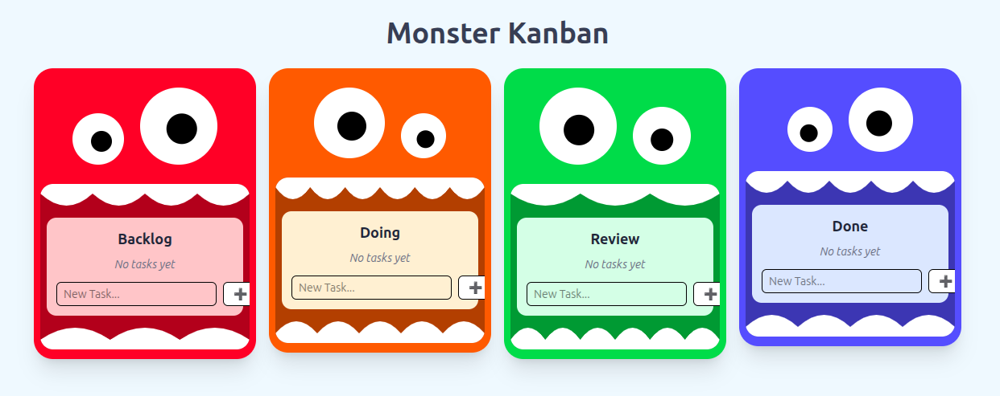

# Monster Kanban Board

The following files were known to be broken by a previous intern:

- server/db.js
- server/routes/tasks.js
- src/api/tasks.js

It used to look like this, and management would like to undo the changes and
revert. .

Your onboarding documentation is as follows:

## Running the project

- Fork the repo and clone
- Install dependencies
- Start dev server in `./` and `./server/`

You can now hold `Ctrl` and click the link Vite shows to see the website!

## Project Structure

This project was intentionally built in a simple, understandable way.

```
monster-kanban
 ├─ src
 │  ├─ assets
 │  │  └─ react.svg
 │  ├─ components
 │  │  ├─ Column.jsx
 │  │  ├─ Monster.jsx
 │  │  ├─ Task.jsx
 │  │  └─ KanbanBoard.jsx
 │  ├─ App.jsx
 │  ├─ main.jsx
 │  ├─ index.css
 │  ├─ api
 │  │  └─ tasks.js
 │  └─ App.css
 ├─ eslint.config.js
 ├─ package.json
 ├─ package-lock.json
 ├─ .gitignore
 ├─ README.md
 ├─ vite.config.js
 ├─ index.html
 ├─ server
 │  ├─ db.js
 │  ├─ app.js
 │  ├─ db
 │  ├─ routes
 │  │  └─ tasks.js
 │  ├─ package.json
 │  └─ package-lock.json
 └─ public
    ├─ robots.txt
    └─ vite.svg
```

---

🎉 Final Message

This project is designed to be:

- Fun 👾

- Refresh information from the last workshop 💡

- Easy to expand 🧱

- A great teaching tool 🎓

Add new monsters, animations, or even user accounts — the sky’s the limit.
